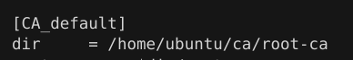
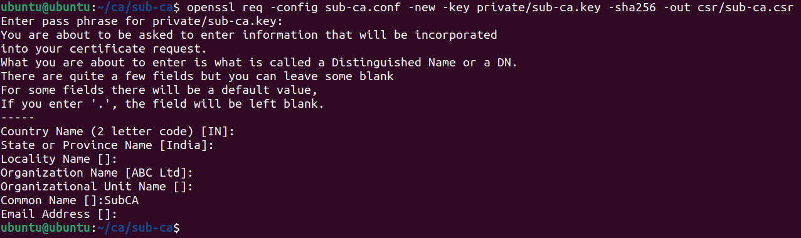
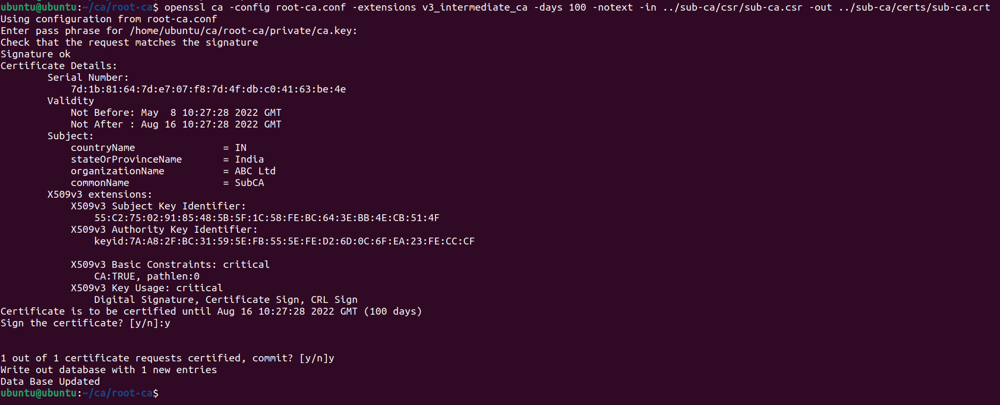
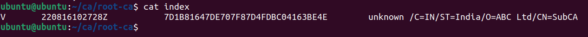
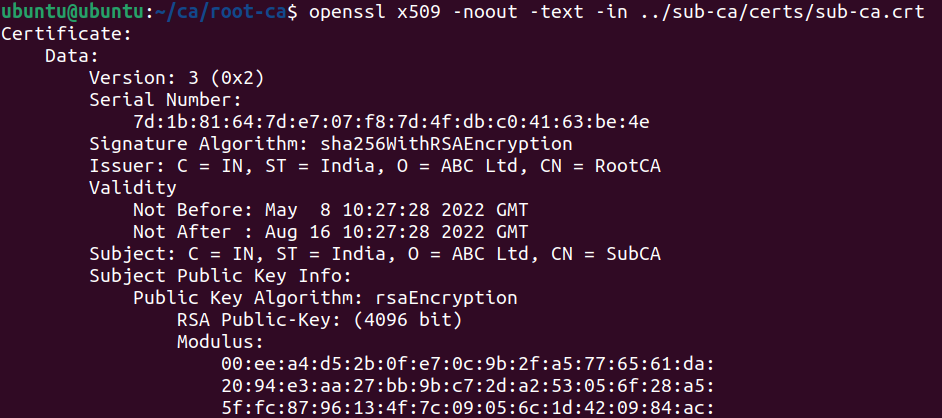
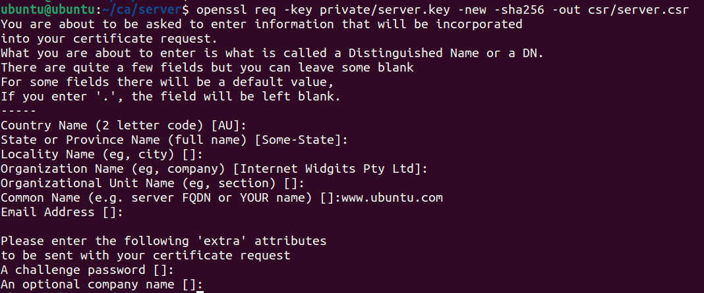

# AES256-openssl-creating-certificate

## 1. Creating directory CA with Sub-CA and Root-CA

Firstly let us start by creating a directory **ca** consisting  of **root-ca**, **sub-ca** and **server** . Each of these sub-directories will contain:
* **private key**
* **certs** (certificate)
* **newcerts** (new certificate)
* **crl** (certificate revocation list)
* **csr** (certificate signing request)

```
mkdir -p ca/{root-ca,sub-ca,server}/{private,certs,newcerts,crll,csr}
```
___
Now if you will now run:  **`tree ca`** , then you will be able to see a structure like this:
<!--  -->


And if this doesn't appear then **install tree** on your system , by running this command: 
```
sudo apt install tree  
```
Now again try the same command `tree ca`
___
## 2. Making the **private** named directory *private*
>  chmod 700 Protects a file against any access from other users, while the issuing user still has full access.
```
chmod -v 700 ca/{root-ca,sub-ca,server}/private
```


## 3. Creating index file
The index file will be only needed to *root-ca* and *sub-ca*. The sub-ca is intermediate certificate authority authorized by the parent root.
```
touch ca/{root-ca,sub-ca}/index
```
## 4. Making serial files for **root-ca** and **sub-ca**
Serial entries are the files that we need while issuing and signing certificate requests.
```
openssl rand -hex 16 > ca/root-ca/serial
openssl rand -hex 16 > ca/sub-ca/serial
```
 > Again run `tree ca` to see the structure of files.

 > The public key of a server would be signed by a trusted certificate auhtority to have a trusted relationship with it and as his clients we would automatically trust any server that have been signed with the trusted key.
 ## 5. Time to create **private key** for **root-ca** and we'll use **AES256** for encryption.
 >AES algorithm is considered to be quite safe.
 ```
 cd ca
 openssl genrsa -aes256 -out root-ca/private/ca.key 4096
 ```
 Now you will be asked to enter a pass phrase which is a part of our encryption . So type a solid pass phrase and don't forget it as it will be used further too. Then press enter and rewrite again to verify.
 * this will look something like this :

>4096 is the length of bits of the private key of root-ca.

Again follow the same step for making the private-key for sub-ca.
```
openssl genrsa -aes256 -out sub-ca/private/sub-ca.key 4096
 ```
Now we will do the same for server key but this time we will take key size of 2048 bits and we don't want any encryption system also.
>This is because the server will be dealing with the encrypted data all the time , so for reducing the load we'll be taking key of less size and we don't want to enter the pass phrase whenever the server starts, so we will not use AES encyption this time .
```
openssl genrsa -out server/private/server.key 2048
```
## 6. Time for **public key** and **root certificate authority**
>public key will be created within the process.

>For this purpose we will need a configuration file which will avoid our time from writing every information on the command line. So follow the following steps:
```
vim root-ca/root-ca.conf
```
Now copy paste the following configurations in that config file and save it.
> **KEEP IN MIND TO PUT THE PATH OF THE DIRECTORY IN THE `CA_DEFAULT` ACCORDING TO YOUR SYSTEM.**
> 
> 
> this dir should contain the path that is according to your system. 
```

[ca]
#/home/ubuntu/ca/root-ca/root-ca.conf
#enter your path (the above one is the path of my system)
#see man ca
default_ca    = CA_default

[CA_default]
dir     = /home/ubuntu/ca/root-ca
certs     =  $dir/certs
crl_dir    = $dir/crl
new_certs_dir   = $dir/newcerts
database   = $dir/index
serial    = $dir/serial
RANDFILE   = $dir/private/.rand

private_key   = $dir/private/ca.key
certificate   = $dir/certs/ca.crt

crlnumber   = $dir/crlnumber
crl    =  $dir/crl/ca.crl
crl_extensions   = crl_ext
default_crl_days    = 30

default_md   = sha256

name_opt   = ca_default
cert_opt   = ca_default
default_days   = 365
preserve   = no
policy    = policy_strict

[ policy_strict ]
countryName   = supplied
stateOrProvinceName  =  supplied
organizationName  = match
organizationalUnitName  =  optional
commonName   =  supplied
emailAddress   =  optional

[ policy_loose ]
countryName   = optional
stateOrProvinceName  = optional
localityName   = optional
organizationName  = optional
organizationalUnitName   = optional
commonName   = supplied
emailAddress   = optional

[ req ]
# Options for the req tool, man req.
default_bits   = 2048
distinguished_name  = req_distinguished_name
string_mask   = utf8only
default_md   =  sha256
# Extension to add when the -x509 option is used.
x509_extensions   = v3_ca

[ req_distinguished_name ]
countryName                     = Country Name (2 letter code)
stateOrProvinceName             = State or Province Name
localityName                    = Locality Name
0.organizationName              = Organization Name
organizationalUnitName          = Organizational Unit Name
commonName                      = Common Name
emailAddress                    = Email Address
countryName_default  = IN
stateOrProvinceName_default = India
0.organizationName_default = ABC Ltd

[ v3_ca ]
# Extensions to apply when createing root ca
# Extensions for a typical CA, man x509v3_config
subjectKeyIdentifier  = hash
authorityKeyIdentifier  = keyid:always,issuer
basicConstraints  = critical, CA:true
keyUsage   =  critical, digitalSignature, cRLSign, keyCertSign

[ v3_intermediate_ca ]
# Extensions to apply when creating intermediate or sub-ca
# Extensions for a typical intermediate CA, same man as above
subjectKeyIdentifier  = hash
authorityKeyIdentifier  = keyid:always,issuer
#pathlen:0 ensures no more sub-ca can be created below an intermediate
basicConstraints  = critical, CA:true, pathlen:0
keyUsage   = critical, digitalSignature, cRLSign, keyCertSign

[ server_cert ]
# Extensions for server certificates
basicConstraints  = CA:FALSE
nsCertType   = server
nsComment   =  "OpenSSL Generated Server Certificate"
subjectKeyIdentifier  = hash
authorityKeyIdentifier  = keyid,issuer:always
keyUsage   =  critical, digitalSignature, keyEncipherment
extendedKeyUsage  = serverAuth
```
Go through the file and read the things that have been applied.

The main things that are present in that config file are:
* Common Name
* Organization's name
* Country name
* State and Province
* Email
* Some default names
* Extension v3_ca is for root-ca.

Now move into the root-ca directory
```
cd root-ca/
```
and then run this command for making new x509 certificate (with the help of the private key) and you can provide the number days you want the certificate for.
>We will be using SHA256 for making the message digest and the number of days is all upto you (in this I have taken 100 days)
```
openssl req -config root-ca.conf -key private/ca.key -new -x509 -days 100 -sha256 -extensions v3_ca -out certs/ca.crt
```

Enter the passphrase and in the names field you can write anything or u can just press enter and it will taked the name that are used in default. Write RootCA in common name.

## 7. Time to check the root-ca certificate that we just created.
```
openssl x509 -noout -in certs/ca.crt -text
```
> -text form so that we can read some of the things

>So, we have finally created a self signed Certificate for root-ca


>Root certificate authority should always be offline .

## 8. Time for **Sub-CA** or **Intermediate CA** 
>we have different CA for different purposes.

Jump into the sub-ca directory:
```
cd ../sub-ca/
```
>We will make the same config file for sub-ca also.

```
vim sub-ca.conf
```
Now copy paste the whole code in this config file.
> **KEEP IN MIND TO PUT THE PATH OF THE DIRECTORY IN THE `CA_DEFAULT` ACCORDING TO YOUR SYSTEM.**
```
[ca]
#see man ca
default_ca    = CA_default

[CA_default]
dir     = /home/ubuntu/ca/sub-ca
certs     =  $dir/certs
crl_dir    = $dir/crl
new_certs_dir   = $dir/newcerts
database   = $dir/index
serial    = $dir/serial
RANDFILE   = $dir/private/.rand

private_key   = $dir/private/sub-ca.key
certificate   = $dir/certs/sub-ca.crt

crlnumber   = $dir/crlnumber
crl    =  $dir/crl/ca.crl
crl_extensions   = crl_ext
default_crl_days    = 30

default_md   = sha256

name_opt   = ca_default
cert_opt   = ca_default
default_days   = 365
preserve   = no
policy    = policy_loose

[ policy_strict ]
countryName   = supplied
stateOrProvinceName  =  supplied
organizationName  = match
organizationalUnitName  =  optional
commonName   =  supplied
emailAddress   =  optional

[ policy_loose ]
countryName   = optional
stateOrProvinceName  = optional
localityName   = optional
organizationName  = optional
organizationalUnitName   = optional
commonName   = supplied
emailAddress   = optional

[ req ]
# Options for the req tool, man req.
default_bits   = 2048
distinguished_name  = req_distinguished_name
string_mask   = utf8only
default_md   =  sha256
# Extension to add when the -x509 option is used.
x509_extensions   = v3_ca

[ req_distinguished_name ]
countryName                     = Country Name (2 letter code)
stateOrProvinceName             = State or Province Name
localityName                    = Locality Name
0.organizationName              = Organization Name
organizationalUnitName          = Organizational Unit Name
commonName                      = Common Name
emailAddress                    = Email Address
countryName_default  = IN
stateOrProvinceName_default = India
0.organizationName_default = ABC Ltd

[ v3_ca ]
# Extensions to apply when createing root ca
# Extensions for a typical CA, man x509v3_config
subjectKeyIdentifier  = hash
authorityKeyIdentifier  = keyid:always,issuer
basicConstraints  = critical, CA:true
keyUsage   =  critical, digitalSignature, cRLSign, keyCertSign

[ v3_intermediate_ca ]
# Extensions to apply when creating intermediate or sub-ca
# Extensions for a typical intermediate CA, same man as above
subjectKeyIdentifier  = hash
authorityKeyIdentifier  = keyid:always,issuer
#pathlen:0 ensures no more sub-ca can be created below an intermediate
basicConstraints  = critical, CA:true, pathlen:0
keyUsage   = critical, digitalSignature, cRLSign, keyCertSign

[ server_cert ]
# Extensions for server certificates
basicConstraints  = CA:FALSE
nsCertType   = server
nsComment   =  "OpenSSL Generated Server Certificate"
subjectKeyIdentifier  = hash
authorityKeyIdentifier  = keyid,issuer:always
keyUsage   =  critical, digitalSignature, keyEncipherment
extendedKeyUsage  = serverAuth
```
> This time we will not generate **self signed certificate** because this time we create a certificate signing request to the **root-ca** i.e. instead of *x509* we will create *csr* to the root-ca

Run this code for  creating **CSR**
```
openssl req -config sub-ca.conf -new -key private/sub-ca.key -sha256 -out csr/sub-ca.csr
```
Again do the same thing that we did on the 6th step. 
Like enter the pass phrase press enter-enter and this time on *common name* type *SubCA*.



## 9. **Root-CA** will sign the certificate now

Go back to the **root-ca** directory
```
cd -
```
Now create the certificate:
```
openssl ca -config root-ca.conf -extensions v3_intermediate_ca -days 100 -notext -in ../sub-ca/csr/sub-ca.csr -out ../sub-ca/certs/sub-ca.crt
```
>If this somehow gives error then you haven't put the correct path of the directory in the `CA_DEFAULT` inside the config file.

After running the code enter the pass phrase and then type 'y' and 'y' in the following choices that will appear and then your certificate is successfully created.



Now again run the `tree` command to see the structure and this time you will notice something different
```
tree ../../ca
```
## 10. Check the index file and notice the serial number
```
cat index
```

Now check the certificate that we just created.

```
openssl x509 -noout -text -in ../sub-ca/certs/sub-ca.crt
```


## 11. Now's the time for **server** directory.

Change the directory
```
cd ../server/
```
Generate the signing request
```
openssl req -key private/server.key -new -sha256 -out csr/server.csr
```



>You can press enter in every field if you wish but give any name or link in Common Name section.

## 12. Now Sub-CA will sign the certificate.
```
cd ../sub-ca
```
Then run this command for making the certificate
```
openssl ca -config sub-ca.conf -extensions server_cert -days 100 -notext -in ../server/csr/server.csr -out ../server/certs/server.crt
```
Then follow the same steps that we did while making the certificate for sub-ca

Now check the backup copy of the certificate that we issued
```
ls newcerts
```
## 13. Chained Certificate

Now we might also depend on server with which we are going to use the certificate server.crt for which we need a chained certificate file that contains full copy of the signing authority and the server.crt 

```
cat server.crt ../../sub-ca/certs/sub-ca.crt > chained.crt
```
```
cd ..
```

